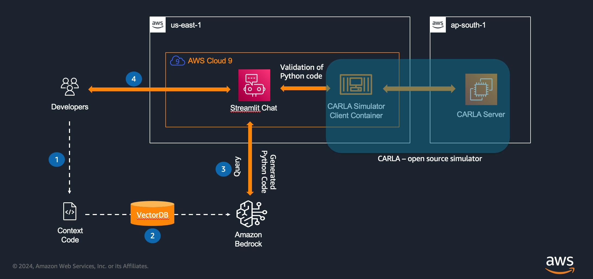
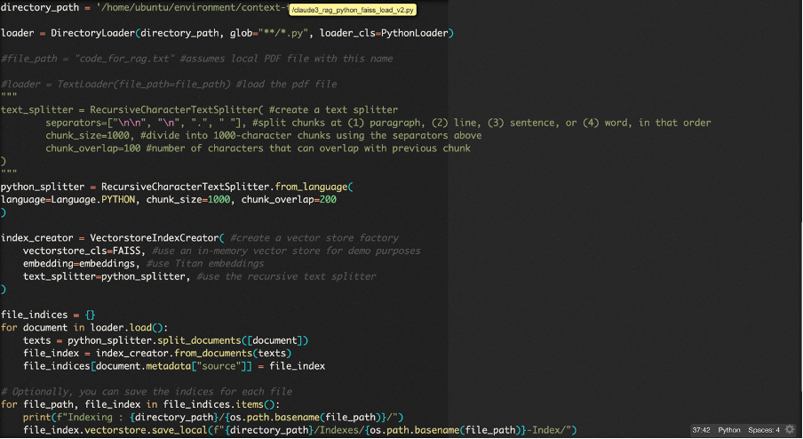
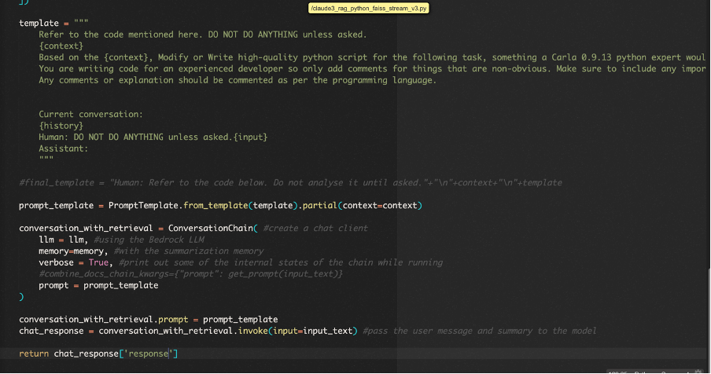
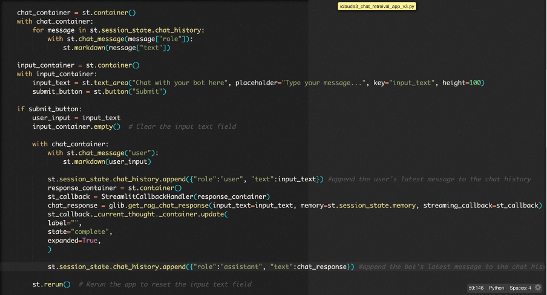

# Generate Synthetic Data for Automotive and Manufacturing use cases with Amazon Bedrock and Third-Party Simulators

In this post, we aim to show how autonomous mobility teams can integrate Amazon Bedrock and third-party simulators to boost automotive and manufacturing synthetic image and telemetry generation by providing more accurate and realistic data for testing and validation purposes. This approach can cut time and costs related to scenario generation and data collection for various use cases such as Autonomous mobility, model training on visual and other sensory data, etc. Another advantage of integrating with third-party simulators is that automotive teams need not overhaul the process being used currently for the synthetic generation scenarios. 
For this blog, we will use an open-source simulator CARLA, which can be interacted with a Python API for generating code against the server. However, this could well be any other simulator.

## Pre-requisites
AWS Cloud9 IDE or any other IDE with python installed (preferably 3.8 and above)
Streamlit library 
docker runtime

## Implelemtation
This reference architecture is implemented with 3 main files. In actual scaled out production versions, the architecture can encompass various components as per the Well-Architected Frameworks. For example, this post the ingestion pipelines, LLM response module and the CARLA client are all running in a Cloud9 environment. In production use cases, these components should be running in different isolated components.

•	Claude3_rag_python_faiss_load_v2.py -> This contains the code for ingestion pipeline the document and context code to the RAG vector database with custom splitter.
•	Claude3_rag_python_faiss_stream_v3.py -> This contains code for the backend LLM invocation functions and the prompt enhancement modules.
•	Claude3_chat_retreival_app_v3.py -> This is the Streamlit application for the UI

1.	Ingestion Pipeline: Developers can store the context queries/ documentation, based on which the code will be generated. For this blog, the standard RAG technique with a custom splitter is used to store each query in a different in-memory index. Please refer the screenshot below:

2.	Once the files have been stored into the Vector database, the next step is to enhance the prompt by combining user input with the tokens from the Vector database. In this post, we use Langchain to create a prompt template and specify the order of inputs and chat history, since we are building a conversational UI.

3.	For this post, the front end is a simple Streamlit application which works as the UI for code generation. We also add a section for the validation part, which is a client to interact with the CARLA server and display the images output. For this post we are using a python script running on a docker container on the Cloud9 instance, which also provides the local file setup for storing and retrieving the generated images/ output files. For Production use cases, the UI and other components can be developed based on Well Architected framework. It could also only keep the code generation part as a separate UI and the Validation could be built separately depending on the use case – virtual CAN/ images produced here can be further uploaded to a S3 bucket for seamless access to further deep learning model trainings for autonomous driving and other use cases.

## Sample Prompts:

a. modify / generate code in your context..change the server ip to 65.1.109.59, can you modify the code to add 100 vehicles spawned and also change the ego vehicle color to Red. Set the Carla map as Town03. Add ego vehicle and attach camera to observe. Set autopilot mode on.Capture images taken from the camera attached to the ego vehicle and save it location /app/carla-output/images folder. Name these images in ascending order of time and in jpg format.Add configuration to run this program for 10 seconds.DO NOT EXPLAIN the code unless asked.display the full code.

b. can you modify the code to change weather settings to night. Display full code.

c. can you modify the code to spawn a different vehicle in a different random location. Display full code.

## Cleanup
Make sure to terminate the instance if you are running this on a Cloud9 instance or EC2 instance. Go to the respective AWS service page via the console and terminate the instances.